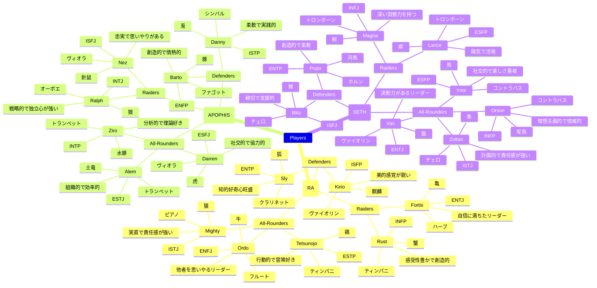

# Scenario

## Frames

```mermaid

gantt
    dateFormat  X
    axisFormat  %s
    tickInterval 6second
    title      Apophis vs Ra
    %% Unified to 97 seconds in total

    %% To avoid wasting time on titles like "Episode x: △△", use embedded objects in the opening scene for expression (it doesn't matter if it's unnoticed)
    %% ED === Next Episode Preview

    section Ep.1 ""
    OP-Roll :0, 16s
    
    ED              :157, 3s

    section Ep.2 "Ancle Hold"
    MainContent     :a, 0, 157s
    ED              :157, 3s

    section Ep.3 "Chain"
    MainContent     :a, 0, 157s
    ED              :157, 3s

    section Ep.4 "Counter"
    MainContent     :a, 0, 157s
    ED              :157, 3s

    section Ep.5 "Charge"
    MainContent     :a, 0, 157s
    ED              :157, 3s

    section Ep.6
    MainContent     :a, 0, 157s
    ED              :157, 3s

    section Ep.7
    MainContent     :a, 0, 157s
    ED              :157, 3s

    section Ep.8
    MainContent     :a, 0, 157s
    ED              :157, 3s

    section Ep.9
    MainContent     :a, 0, 157s
    ED              :157, 3s

    section Ep.10
    MainContent     :a, 0, 157s
    ED              :157, 3s

    section Ep.11 "MIGHTY"
    MainContent     :a, 0, 157s
    ED              :157, 3s

    section Ep.12 "vs Ra"
    MainContent     :a, 0, 157s
    ED              :157, 3s

    section Ep.13 "VICTORY"
    MainContent     :a, 0, 157s
    ED              :157, 3s

    section Ep.14 ""
    MainContent     :a, 0, 157s
    ED              :157, 3s

    section Ep.15 ""
    MainContent     :a, 0, 157s
    ED              :157, 3s

```

## Characters

| チーム     | 役割           | 名前       | 動物  | 性格タイプ | 特徴                      | 楽器        |
|------------|----------------|------------|-------|------------|---------------------------|-------------|
| **RA**     | **Raiders**     | Rust       | 蟹    | INFP       | 感受性豊かで創造的         | ティンパニ  |
|            |                 | Fortis     | 亀    | ENTJ       | 自信に満ちたリーダー       | ハープ      |
|            | **Defenders**   | Kirio      | 麒麟  | ISFP       | 美的感覚が鋭い             | ヴァイオリン|
|            |                 | Sly        | 狐    | ENTP       | 知的好奇心旺盛             | クラリネット|
|            | **All-Rounders**| Mighty     | 猿    | ISTJ       | 実直で責任感が強い         | ピアノ      |
|            |                 | Ordo       | 牛    | ENFJ       | 他者を思いやるリーダー     | フルート    |
|            |                 | Tetsunojo  | 鶏    | ESTP       | 行動的で冒険好き           | ティンパニ  |
| **APOPHIS**| **Raiders**     | Ralph      | 狼    | INTJ       | 戦略的で独立心が強い       | オーボエ    |
|            |                 | Nez        | 針鼠  | ISFJ       | 忠実で思いやりがある       | ヴィオラ    |
|            | **Defenders**   | Barto      | 豚    | ENFP       | 創造的で情熱的             | ファゴット  |
|            |                 | Danny      | 兎    | ISTP       | 柔軟で実践的               | シンバル    |
|            | **All-Rounders**| Darren     | 虎    | ESFJ       | 社交的で協力的             | ヴィオラ    |
|            |                 | Ziro       | 水豚  | INTP       | 分析的で理論好き           | トランペット|
|            |                 | Alem       | 土竜  | ESTJ       | 組織的で効率的             | トランペット|
| **SETH**   | **Raiders**     | Magna      | 鰐    | INFJ       | 深い洞察力を持つ           | トロンボーン|
|            |                 | Lance      | 犀    | ESFP       | 陽気で活発                 | トロンボーン|
|            | **Defenders**   | Blitz      | 猪    | ISFJ       | 親切で支援的               | チェロ      |
|            |                 | Popo       | 河馬  | ENTP       | 創造的で柔軟               | ホルン      |
|            | **All-Rounders**| Van        | 猫    | ENTJ       | 決断力があるリーダー       | ヴァイオリン|
|            |                 | Orson      | 駝鳥  | INFP       | 理想主義的で情緒的         | コントラバス|
|            |                 | Ymir       | 馬    | ESFP       | 社交的で楽しさ重視         | コントラバス|
|            |                 | Zoltan     | 象    | ISTJ       | 計画的で責任感が強い       | チェロ      |

## Field Concepts

### Urban Scramble Intersection

- The scene is set in an urban scramble intersection.
- There are different times of day: morning, afternoon, evening, and night.
- Numerous skyscrapers tower above.
- The focal point is the scramble intersection itself.
- There are not three, but approximately nine traffic signals illuminated, glowing in a gradient like an illumination display.
- In the background, instead of a traditional smoking area, there is a sign that reads "Ice Smoking Area" with an ice cream icon instead of a smoke symbol.
- Nearby, there are tents, barbecues, and cherry blossom viewing.
- The center of the intersection features white lines converging to form a competition court for the Asian sport "Kabaddi".
- The scene is set amidst heavy rainfall.
