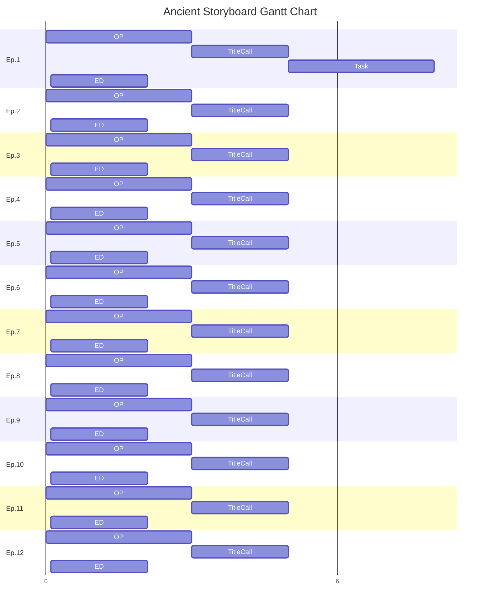

```mermaid

gantt
    dateFormat  X
    axisFormat  %s
    tickInterval 6second
    title       Ancient Storyboard Gantt Chart
    %% 全体で97秒間に統一

    section Ep.1
    OP              :h, 0, 3s
    TitleCall       :tc, after h, 2s
    Task            :after tc, 3s
    ED              :0, 95, 2s

    section Ep.2
    OP              :h, 0, 3s
    TitleCall       :tc, after h, 2s
    ED              :0, 95, 2s

    section Ep.3
    OP              :h, 0, 3s
    TitleCall       :tc, after h, 2s
    ED              :0, 95, 2s

    section Ep.4
    OP              :h, 0, 3s
    TitleCall       :tc, after h, 2s
    ED              :0, 95, 2s

    section Ep.5
    OP              :h, 0, 3s
    TitleCall       :tc, after h, 2s
    ED              :0, 95, 2s

    section Ep.6
    OP              :h, 0, 3s
    TitleCall       :tc, after h, 2s
    ED              :0, 95, 2s
    section Ep.7
    OP              :h, 0, 3s
    TitleCall       :tc, after h, 2s
    ED              :0, 95, 2s

    section Ep.8
    OP              :h, 0, 3s
    TitleCall       :tc, after h, 2s
    ED              :0, 95, 2s

    section Ep.9
    OP              :h, 0, 3s
    TitleCall       :tc, after h, 2s
    ED              :0, 95, 2s
    section Ep.10
    OP              :h, 0, 3s
    TitleCall       :tc, after h, 2s
    ED              :0, 95, 2s

    section Ep.11
    OP              :h, 0, 3s
    TitleCall       :tc, after h, 2s
    ED              :0, 95, 2s

    section Ep.12
    OP              :h, 0, 3s
    TitleCall       :tc, after h, 2s
    ED              :0, 95, 2s

```
