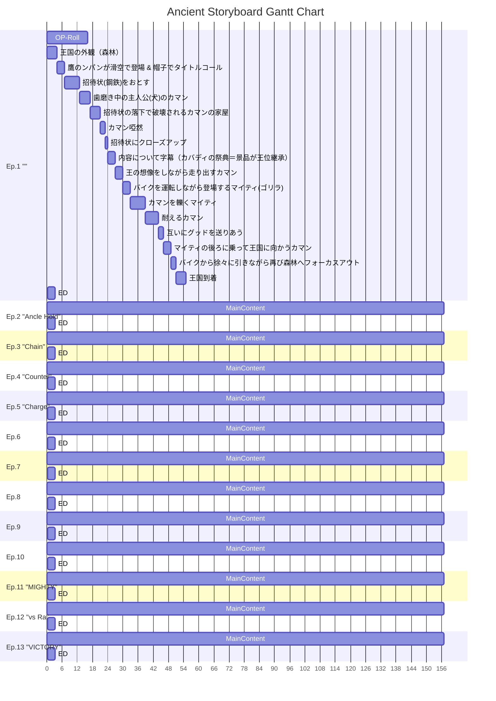

```mermaid

gantt
    dateFormat  X
    axisFormat  %s
    tickInterval 6second
    title       Ancient Storyboard Gantt Chart
    %% Unified to 97 seconds in total

    %% To avoid wasting time on titles like "Episode x: △△", use embedded objects in the opening scene for expression (it doesn't matter if it's unnoticed)
    %% ED === Next Episode Preview

    section Ep.1 ""
    OP-Roll :0, 16s
    王国の外観（森林）                  :a1, 0, 4s
    鷹のンパンが滑空で登場 & 帽子でタイトルコール　　　 :a2, after a1, 3s
    招待状(鋼鉄)をおとす　　         :a3, after a2, 6s
    歯磨き中の主人公(犬)のカマン:a4, after a3, 4s

    招待状の落下で破壊されるカマンの家屋: a5, after a4, 4s
    カマン啞然         : a6, after a5, 2s
    招待状にクローズアップ : a7, after a6, 1s
    内容について字幕（カバディの祭典＝景品が王位継承）          : a8, after a7, 3s
    王の想像をしながら走り出すカマン: a9, after a8, 3s

    バイクを運転しながら登場するマイティ(ゴリラ): a10, after a9, 3s
    カマンを轢くマイティ: a11, after a10, 6s
    耐えるカマン: a12, after a11, 5s
    互いにグッドを送りあう: a13, after a12, 2s

    マイティの後ろに乗って王国に向かうカマン: a14, after a13, 3s
    バイクから徐々に引きながら再び森林へフォーカスアウト: a15, after a14, 2s

    王国到着: a16, after a15, 4s
    ED              :157, 3s

    section Ep.2 "Ancle Hold"
    MainContent     :a, 0, 157s
    ED              :157, 3s

    section Ep.3 "Chain"
    MainContent     :a, 0, 157s
    ED              :157, 3s

    section Ep.4 "Counter"
    MainContent     :a, 0, 157s
    ED              :157, 3s

    section Ep.5 "Charge"
    MainContent     :a, 0, 157s
    ED              :157, 3s

    section Ep.6
    MainContent     :a, 0, 157s
    ED              :157, 3s

    section Ep.7
    MainContent     :a, 0, 157s
    ED              :157, 3s

    section Ep.8
    MainContent     :a, 0, 157s
    ED              :157, 3s

    section Ep.9
    MainContent     :a, 0, 157s
    ED              :157, 3s

    section Ep.10
    MainContent     :a, 0, 157s
    ED              :157, 3s

    section Ep.11 "MIGHTY"
    MainContent     :a, 0, 157s
    ED              :157, 3s

    section Ep.12 "vs Ra"
    MainContent     :a, 0, 157s
    ED              :157, 3s

    section Ep.13 "VICTORY"
    MainContent     :a, 0, 157s
    ED              :157, 3s
```
