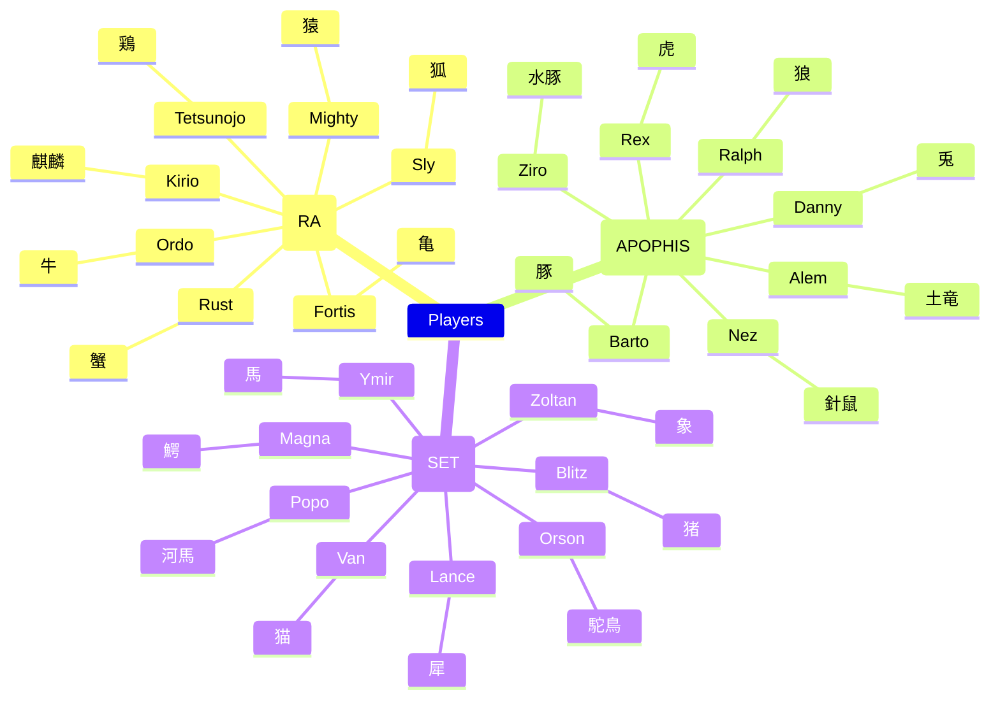

# Scenario

## Frames

```mermaid

gantt
    dateFormat  X
    axisFormat  %s
    tickInterval 6second
    title      Apophis vs Ra
    %% Unified to 97 seconds in total

    %% To avoid wasting time on titles like "Episode x: △△", use embedded objects in the opening scene for expression (it doesn't matter if it's unnoticed)
    %% ED === Next Episode Preview

    section Ep.1 ""
    OP-Roll :0, 16s
    
    ED              :157, 3s

    section Ep.2 "Ancle Hold"
    MainContent     :a, 0, 157s
    ED              :157, 3s

    section Ep.3 "Chain"
    MainContent     :a, 0, 157s
    ED              :157, 3s

    section Ep.4 "Counter"
    MainContent     :a, 0, 157s
    ED              :157, 3s

    section Ep.5 "Charge"
    MainContent     :a, 0, 157s
    ED              :157, 3s

    section Ep.6
    MainContent     :a, 0, 157s
    ED              :157, 3s

    section Ep.7
    MainContent     :a, 0, 157s
    ED              :157, 3s

    section Ep.8
    MainContent     :a, 0, 157s
    ED              :157, 3s

    section Ep.9
    MainContent     :a, 0, 157s
    ED              :157, 3s

    section Ep.10
    MainContent     :a, 0, 157s
    ED              :157, 3s

    section Ep.11 "MIGHTY"
    MainContent     :a, 0, 157s
    ED              :157, 3s

    section Ep.12 "vs Ra"
    MainContent     :a, 0, 157s
    ED              :157, 3s

    section Ep.13 "VICTORY"
    MainContent     :a, 0, 157s
    ED              :157, 3s

    section Ep.14 ""
    MainContent     :a, 0, 157s
    ED              :157, 3s

    section Ep.15 ""
    MainContent     :a, 0, 157s
    ED              :157, 3s

```

## Characters

```mermaid
mindmap
    Players
        r(RA)
            Rust
                蟹
            Fortis
                亀
            Kirio
                麒麟
            Sly
                狐
            Mighty
                猿
            Ordo
                牛
            Tetsunojo
                鶏
        a(APOPHIS)
            Ralph
                狼
            Nez
                針鼠
            Barto
                豚
            Danny
                兎
            Rex
                虎
            Ziro
                水豚
            Alem
                土竜
        s(SET)
            Magna
                鰐
            Lance
                犀
            Blitz
                猪
            Popo
                河馬
            Van
                猫
            Orson
                駝鳥
            Ymir
                馬
            Zoltan
                象
```

