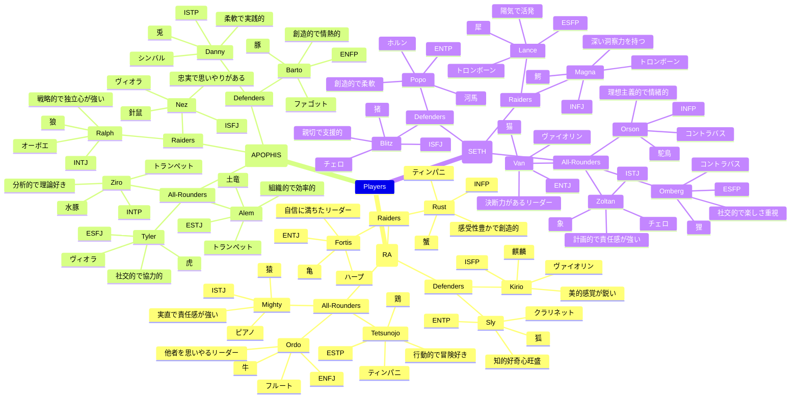

# Scenario

## Frames

```mermaid
gantt
    dateFormat  X
    axisFormat  %s
    tickInterval 6second
    title      Apophis vs Ra
    %% Unified to 97 seconds in total

    %% To avoid wasting time on titles like "Episode x: △△", use embedded objects in the opening scene for expression (it doesn't matter if it's unnoticed)
    %% ED === Next Episode Preview

    section Rules
    コピーA :e1, 0, 2s
    ハイキック+避け :e2, after e1, 1s
    コピーB : e3, after e2, 2s
    ステップ :e4, after e3, 1s
    コピーC : e5, after e4, 2s
    ライオンジャンプ :e6, after e5, 1s
    コピーD : e7, after e6, 3s
    トピックコール"ルールについて" : e8, 13, 2s
    explain"攻守を交代しながら進める" : e9, after e8, 6s
    explain"Cant & Struggle" : e10, after e9, 12s
    explain"Lobby & Line Out" : e11, after e10, 6s
    explain"Empty & Baulk & Do or Die" : e12, after e11, 9s
    explain"Anti" : e13, after e12, 8s
    explain"アウトと人数増減とRona" : e14, after e13, 10s
    explain"Bonus" : e15, after e14, 14s
    explain"Super Tackle" : e16, after e15, 6s
    explain"Sportsmanship" : e17, after e16, 9s
    ED              :97, 3s

    section Anti
    Ancle Hold: m1, 0, 26s
    Thigh Hold : m2, after m1, 19s
    Chain : m3, after m2, 18s
    Charge : m4, after m3, 19s
    Block : m5, after m4, 19s
    Back Hold : m6, after m5, 20s
    Second Tackle : m7, after m6, 20s


```

## Copy

### Jp

- 曰く、猛き野生と狩人の宿世の対峙なり。
- 曰く、太古の狩猟を呼び覚ます、原初の駆け引きなり。
- 曰く、技は、雅やかなる舞踏なり。

斯くの如き闘争の刹那、彼らはこう唱えた。 ”カバディ” と。

### En

- Quoth, it is the fated confrontation between fierce wild beasts and the hunter.
- Quoth, it awakens the ancient hunt, a primordial game of wits.
- Quoth, the skill is akin to a graceful dance.

In such fleeting moments of battle, they chanted thus: "KABADDI".

### Ta

- எனக் கூறினான், இது வீரியமிக்க காட்டுயிர் மற்றும் வேட்டைக்காரன் ஆகியோரின் விதி தீர்க்கப்பட்ட மோதல் ஆகும்.
- எனக் கூறினான், இது பண்டைய வேட்டையைக் காக்கின்றது; முதன்மையான நுண்ணிய யுத்தம்.
- எனக் கூறினான், திறமை சீரிய நடனத்தை ஒத்தது.

அத்தகைய போரின் நொடி பிந்தியபோது, அவர்கள் இவ்வாறு பாட்டினார்கள்: "கபடி" என்று.

## Characters

## Field Concepts

### Urban Scramble Intersection

- The scene is set in an urban scramble intersection.
- There are different times of day: morning, afternoon, evening, and night.
- Numerous skyscrapers tower above.
- The focal point is the scramble intersection itself.
- There are not three, but approximately nine traffic signals illuminated, glowing in a gradient like an illumination display.
- In the background, instead of a traditional smoking area, there is a sign that reads "Ice Smoking Area" with an ice cream icon instead of a smoke symbol.
- Nearby, there are tents, barbecues, and cherry blossom viewing.
- The center of the intersection features white lines converging to form a competition court for the Asian sport "Kabaddi".
- The scene is set amidst heavy rainfall.
