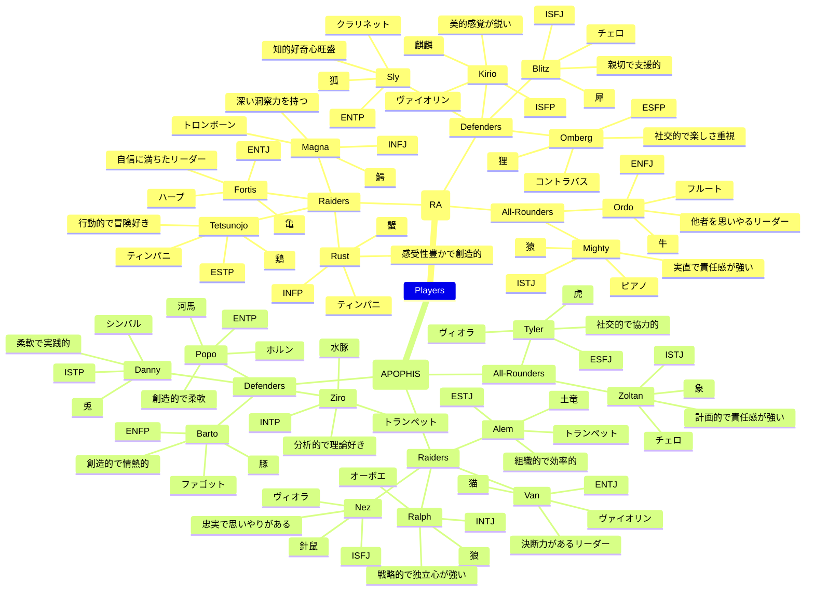

# Scenario

## Frames

```mermaid
gantt
    dateFormat  X
    axisFormat  %s
    tickInterval 6second
    title      Apophis vs Ra
    %% Unified to 97 seconds in total

    %% To avoid wasting time on titles like "Episode x: △△", use embedded objects in the opening scene for expression (it doesn't matter if it's unnoticed)
    %% ED === Next Episode Preview

    section Rules
    コピーA :e1, 0, 2s
    ハイキック+避け :e2, after e1, 1s
    コピーB : e3, after e2, 2s
    ステップ :e4, after e3, 1s
    コピーC : e5, after e4, 2s
    ライオンジャンプ :e6, after e5, 1s
    コピーD : e7, after e6, 3s
    トピックコール"ルールについて" : e8, 13, 2s
    explain"攻守を交代しながら進める" : e9, after e8, 6s
    explain"Cant & Struggle" : e10, after e9, 12s
    explain"Lobby & Line Out" : e11, after e10, 6s
    explain"Empty & Baulk & Do or Die" : e12, after e11, 9s
    explain"Anti" : e13, after e12, 8s
    explain"アウトと人数増減とRona" : e14, after e13, 10s
    explain"Bonus" : e15, after e14, 14s
    explain"Super Tackle" : e16, after e15, 6s
    explain"Sportsmanship" : e17, after e16, 9s
    ED              :97, 3s
```

## Topics & Field Concepts

| Technique          | Field                | Characteristics                                                                                  |
|--------------------|----------------------|--------------------------------------------------------------------------------------------------|
| **Ancle Hold**     | **Tropics**          | 天を覆う巨木、その密林は人知を超えた野生の王国。湿り気を含んだ苔むした大地は油断を許さず、霧が立ち込め、光が葉の隙間からまばらに降り注ぐ。獣の気配が近づき、樹々の囁きが戦士たちに闘争の予感をもたらす。ここでは、全てが静寂の中に渦巻く闘いの序曲なのだ。|
| **Thigh Hold**     | **Dunes**           | 無限に広がる砂の海、灼熱の太陽が照りつけ、砂嵐が咆哮する。乾ききった空気は喉を灼き、砂漠の風が視界を奪う。地平線に揺らぐ蜃気楼が、戦士たちの覚悟を試すかの如く立ちはだかる。ここでは、砂と汗が交錯し、命を賭けた闘いが繰り広げられる。|
| **Chain**          | **Corporate**       | 高層階にそびえる冷厳なるオフィス、整然と並ぶデスクとガラスの壁は、まるで戦場のような緊張感を醸し出す。静寂が支配するこの空間に、ビジネスの息遣いが重くのしかかる。鋭利なモノクロームの世界で、冷徹な視線が交錯する。観客は無表情のビジネススーツの群れ、戦士たちの闘志を見つめる。|
| **Charge & Block** | **Tidebreaker**     | 白銀の砂浜、蒼穹と海が織りなす美の饗宴。波の音と日差しが心を解き放つが、ここもまた闘いの舞台だ。サーフボードが戯れるその先で、汗と砂が飛び交う壮絶な戦闘が繰り広げられる。リラックスした観客の視線の先に、熾烈な闘争の光景が広がる。|
| **Back Hold**      | **Nexus**           | 夜の都市、雨に濡れたアスファルトにネオンの光が映える。騒がしい交差点の喧騒は、濡れた路面に反射する七色の信号灯にかき消される。車の音、雨の音、傘の下でのささやきが重なり、異次元への扉が今開かれようとしている。喫煙所に代わる“喫アイス所”が、異なる次元の訪れを暗示している。|
| **Second Tackle**  | **Abyss**           | 地の底から轟く怒りの声、赤黒い地面を貫く業火と溶岩の奔流。煙と灰が空を覆い、恐怖の影が蠢く。無数の目が闇の中で光を放ち、地獄の底から闘士たちを見つめる。不気味な静寂と喧噪が交錯するこの地で、果たして勝者は誰なのか。|

## Copy

### Jp

- 曰く、猛き野生と狩人の宿世の対峙なり。
- 曰く、太古の狩猟を呼び覚ます、原初の駆け引きなり。
- 曰く、技は、雅やかなる舞踏なり。

斯くの如き闘争の刹那、彼らはこう唱えた。 ”カバディ” と。

### En

- Quoth, it is the fated confrontation between fierce wild beasts and the hunter.
- Quoth, it awakens the ancient hunt, a primordial game of wits.
- Quoth, the skill is akin to a graceful dance.

In such fleeting moments of battle, they chanted thus: "KABADDI".

### Ta

- எனக் கூறினான், இது வீரியமிக்க காட்டுயிர் மற்றும் வேட்டைக்காரன் ஆகியோரின் விதி தீர்க்கப்பட்ட மோதல் ஆகும்.
- எனக் கூறினான், இது பண்டைய வேட்டையைக் காக்கின்றது; முதன்மையான நுண்ணிய யுத்தம்.
- எனக் கூறினான், திறமை சீரிய நடனத்தை ஒத்தது.

அத்தகைய போரின் நொடி பிந்தியபோது, அவர்கள் இவ்வாறு பாட்டினார்கள்: "கபடி" என்று.

## Actors

